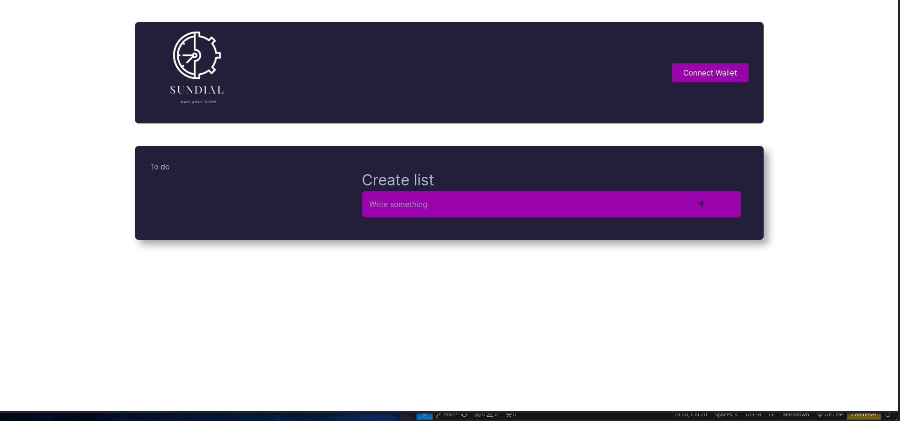

# 0x04-learn_web3

create a simple to-do list dApp



### stack
* Next.js
* Hardhat
* Node
* Solidity
* JS (ESM)

### what it can do
* connect, using Metamask, to an account
* add an item to the list
* mark an tem as `done`
* see a list of items

### recommended
* hardhat env
* next.js 13 or later
* solidity 0.8.9 or later

### to start
* open two terminals
* `cd` to the project directory
* terminal one

    ```bash
        npx hardhat node
    ```

* terminal two

    ```bash
        npx hardhat run --network localhost scripts/deploy.js
    ```

* terminal two

    ```bash
        npm run dev
    ```